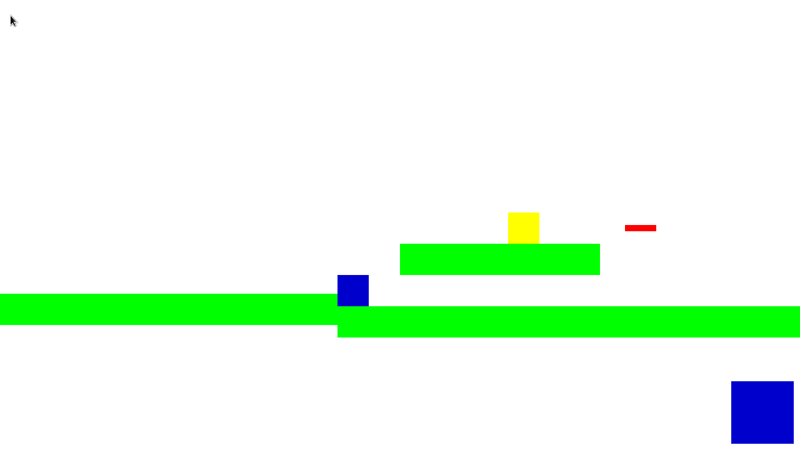

# REUMARCKABLE
---

**REUMARCKABLE** est un jeu-vidéo développé pour un projet d'étude.

Le but du jeu ? Résoudre un puzzle en allant d'un point A à un point B avec le personnage principal.

Mais si ce n'était que ça, le jeu n'aurait rien d'original. Pour l'originalité, il y a un petit "fantôme", après l'avoir bougé, il refait les mouvements à l'inverse pratiquement aussi bien qu'au début !

## Quelques images
---

<p style="text-align:center">Niveau 1</p>
</br>


<p style="text-align:center">Niveau 2</p>
</br>

## Installation
---

### Prérequis
- Python >= 3.10

### Commandes
```bash
git clone https://github.com/benjimania74/REUMARCKABLE.git
cd REUMARCKABLE
python3 -m venv env
source ./env/bin/activate base
pip install -r requirements.txt
deactivate
```

## Lancement
---
Après installation, pour lancer le jeu, il suffit de lancer le fichier `src/main.py` depuis l'environnement précédemment créé.

```bash
source ./env/bin/activate base # se met dans l'environnement
python3 ./src/main.py
```